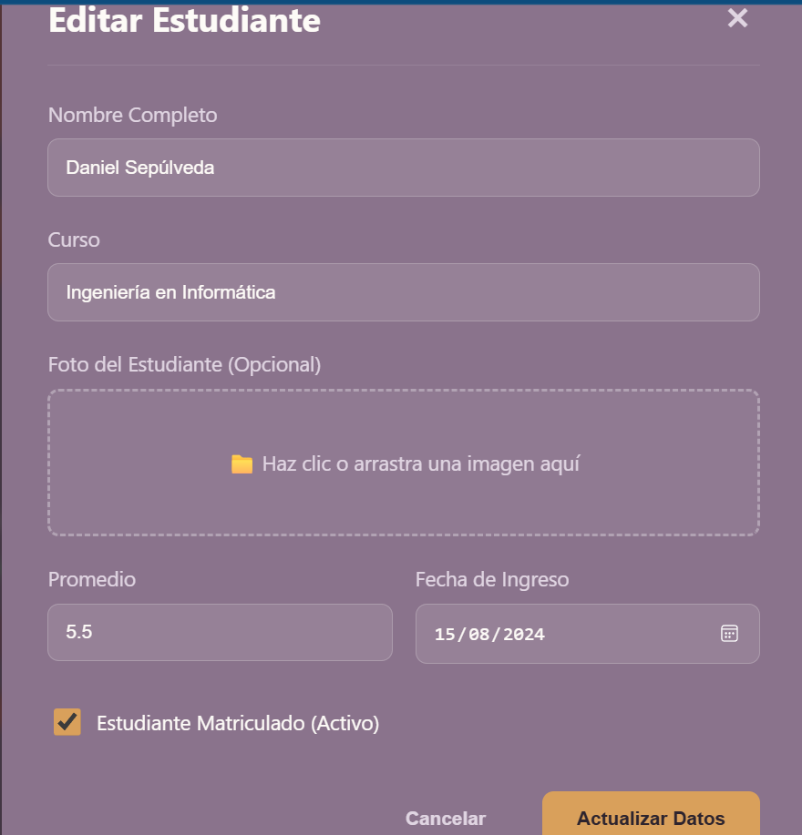
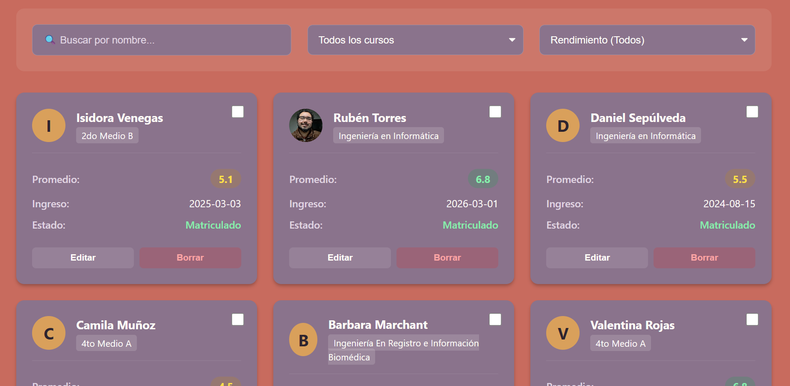

# Sistema de Gestión Académica - Proyecto Integrado

Este proyecto es una aplicación **Full-Stack** desarrollada como parte de mi formación en Ingeniería en Informática, diseñada para la gestión eficiente de estudiantes, analítica de datos y monitoreo de riesgo académico.

## 🚀 Stack Tecnológico

El proyecto utiliza tecnologías modernas enfocadas en escalabilidad y experiencia de usuario:

*   **Frontend**: React, TypeScript, SCSS.
*   **Backend / Servicios**: Express, Node.js para ejecución js, Firebase (Authentication, Firestore).
*   **Visualización**: Recharts para el análisis de riesgo académico.
*   **Herramientas**: Vite, Git, Firebase CLI.

## 📋 Funcionalidades Principales

- **Autenticación Segura**: Login implementado con Google OAuth mediante Firebase.
- **Dashboard Analítico**: Visualización de métricas de riesgo académico mediante gráficos interactivos.
- **Gestión de Estudiantes**: CRUD completo (Crear, Leer, Actualizar, Borrar) para la administración de alumnos.
- **Rutas Protegidas**: Navegación blindada utilizando Private Routes.

## 📸 Interfaz

Aquí puedes visualizar el apartado de gestión de estudiantes:

### Formulario de Gestión (Agregar/Editar)


### Visualización de Cards de Estudiantes


## 🛠️ Instalación y Uso

1. **Clonar el repositorio:**
   ```bash
   git clone [https://github.com/nenemunke/crud-colegio.git](https://github.com/nenemunke/crud-colegio.git)
